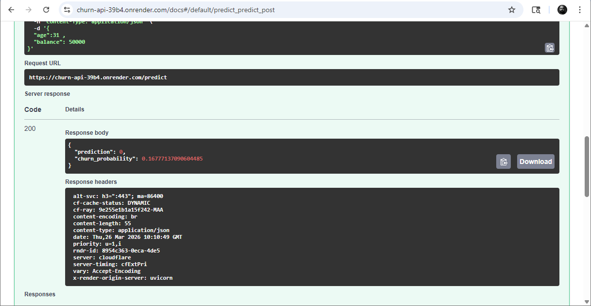

# 🚀 Churn Prediction API (FastAPI + ML)

This project is a production-ready Machine Learning API built using FastAPI.  
It predicts customer churn based on input features and logs predictions into a database.

---

## 📌 Features

- FastAPI REST API
- ML model deployment (Scikit-learn pipeline)
- Input validation using Pydantic
- SQLite database integration
- Logging system
- Dockerized application
- Live deployed API

---

## 🧠 Model Info

- Algorithm: Logistic Regression (via pipeline)
- Input Features:
  - age
  - balance
- Output:
  - prediction (0 = No Churn, 1 = Churn)
  - churn_probability

---

## 📂 Project Structure

```
fastapi-ml-deployment/
│
├── main.py # FastAPI app
├── database.py # SQLite connection
├── model_pipeline.pkl # Trained ML model
├── predictions.db # Database
├── requirements.txt # Dependencies
├── Dockerfile # Docker config
├── README.md # Documentation
└── app.log # Logs
```

---

## ⚙️ Installation (Local Setup)

```bash
git clone <your-repo-url>
cd fastapi-ml-deployment

python -m venv venv
venv\Scripts\activate   # Windows

pip install -r requirements.txt
```

## Running the API
```
Run the API
uvicorn main:app --reload

Open in Browser:
http://127.0.0.1:8000/docs

API Testing (Postman / Swagger)

EndPoint:

API Testing (Postman / Swagger)

Request Body:

{
  "age": 30,
  "balance": 50000
}

Response:

{
  "prediction": 0,
  "churn_probability": 0.25
}

```
## Screenshot



```

🗄️ Database
SQLite used
Table: predictions
Stores:
    age
    balance
    prediction
    probability

🐳 Docker Support
Build Image:
docker build -t churn-api .

docker build -t churn-api .
docker run -p 8000:8000 churn-api

🌐 Live Deployment

👉 https://churn-api-39b4.onrender.com/docs

🚀 Future Improvements
    Add more features to model
    Add authentication
    Switch to PostgreSQL
    Add frontend UI

```
## Authur
Abhihail Jacob
